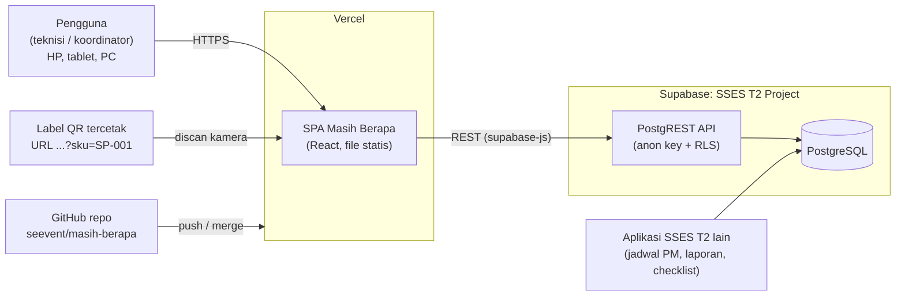
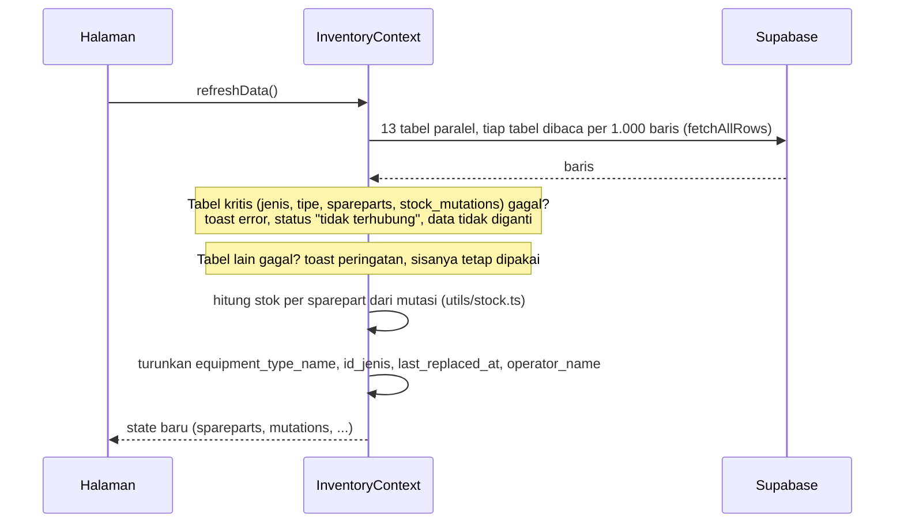
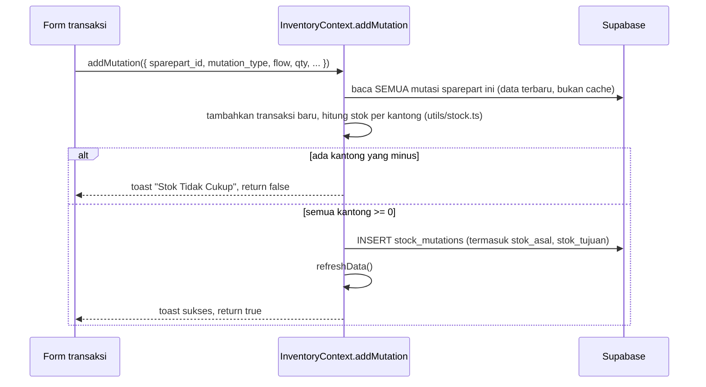

# ARCHITECTURE — Masih Berapa

Arsitektur teknis aplikasi **Masih Berapa** (manajemen sparepart SSES T2) sesuai kode pada branch `main`.

> Dokumen terkait: [DATABASE.md](DATABASE.md) · [PRD.md](PRD.md) · [../AGENTS.md](../AGENTS.md)

## Daftar isi

1. [Ringkasan](#1-ringkasan)
2. [Konteks sistem](#2-konteks-sistem)
3. [Struktur kode](#3-struktur-kode)
4. [Aliran data](#4-aliran-data)
5. [Mesin stok](#5-mesin-stok)
6. [Logika domain lainnya](#6-logika-domain-lainnya)
7. [Antarmuka](#7-antarmuka)
8. [Build, konfigurasi, dan deploy](#8-build-konfigurasi-dan-deploy)
9. [Keamanan](#9-keamanan)
10. [Pengujian dan verifikasi](#10-pengujian-dan-verifikasi)
11. [Keputusan desain](#11-keputusan-desain)
12. [Utang teknis dan batasan](#12-utang-teknis-dan-batasan)

---

## 1. Ringkasan

| Aspek | Keputusan |
|---|---|
| Jenis aplikasi | Single-page application (SPA), responsif untuk HP, tablet, dan desktop. **Bukan PWA** (tidak ada manifest atau service worker) |
| Frontend | React 19, TypeScript 5.9 (strict), Vite 6, Tailwind CSS 4, React Router 7 |
| Backend | **Tidak ada.** Browser berbicara langsung ke Supabase (PostgREST) memakai anon key |
| Database | Supabase PostgreSQL, **dipakai bersama aplikasi lain** (lihat [DATABASE.md](DATABASE.md)) |
| State | Satu `InventoryContext` memuat seluruh data; halaman membaca lewat hook `useInventory()` |
| Hosting | Vercel (static). Deploy otomatis dari GitHub; branch `main` = produksi, branch lain = preview |
| Autentikasi | **Belum ada** |
| Tes otomatis | **Belum ada.** Verifikasi dengan `tsc`, build, dan uji browser (lihat [bagian 10](#10-pengujian-dan-verifikasi)) |

## 2. Konteks sistem



- Aplikasi dan aplikasi SSES T2 lain **berbagi database yang sama**. Perubahan skema harus memperhitungkan keduanya ([DATABASE.md bagian 8](DATABASE.md#8-prosedur-mengubah-database)).
- QR pada label berisi `https://masih-berapa.vercel.app/?sku=<SKU>` (dapat diubah dengan `VITE_PUBLIC_APP_URL`). Membuka URL itu mengarahkan ke halaman Scanner dengan sparepart terisi.

## 3. Struktur kode

```
src/
├── main.tsx                      # entry: <StrictMode><App/></StrictMode>
├── App.tsx                       # provider + router, semua halaman di-lazy-load
├── index.css                     # Tailwind v4 + kelas utilitas (.glass-panel, dll.)
├── vite-env.d.ts                 # tipe import.meta.env (VITE_*)
├── types/index.ts                # tipe domain (satu file)
├── lib/
│   ├── supabase.ts               # klien Supabase + fetchAllRows (paginasi 1000 baris)
│   └── sparepartAnalytics.ts     # (tidak dipakai, lihat bagian 12)
├── context/
│   ├── InventoryContext.tsx      # SEMUA data, aksi tulis, validasi, perhitungan
│   └── NotificationContext.tsx   # toast
├── utils/
│   ├── stock.ts                  # aturan stok (fungsi murni)  ← sumber aturan di sisi aplikasi
│   ├── compatibility.ts          # lokasi/titik/unit yang cocok untuk sebuah sparepart
│   └── shiftUtils.ts             # shift PS/M dan personel berdinas
├── components/
│   ├── layout/                   # AppLayout, Sidebar, HeaderStats (FloatingDock tidak dipakai)
│   ├── mutation/StockFlowFields.tsx   # field Rusak / Serah Terima, dipakai 3 halaman
│   └── dashboard/                # (4 komponen tidak dipakai, lihat bagian 12)
└── pages/                        # satu file per rute
```

### Rute

| Rute | Halaman | Fungsi |
|---|---|---|
| `/` | `DashboardPage` | KPI, tren stok 6 bulan, level inventaris, top moving, transaksi terbaru |
| `/catalog` | `CatalogPage` | CRUD sparepart (grid/list), pilihan tipe kompatibel |
| `/input-sparepart` | `MutationPage` | catat Masuk, Pakai, Bekas, Rusak, Serah Terima |
| `/history` | `HistoryPage` | riwayat, edit, hapus, ekspor Excel |
| `/scanner` | `ScannerPage` | scan QR (kamera) atau ketik SKU/URL, lalu catat transaksi |
| `/print` | `PrintLabelPage` | label QR thermal dan lembar Tom & Jerry, keluaran PDF |
| `/alerts` | `PredictiveAlertsPage` | peringatan berdasarkan MTBF dan stok |
| `/needs` | `PredictiveNeedsPage` | perencanaan kebutuhan tahunan, ekspor Excel |
| `/reports` | `ReportsPage` | klasifikasi fast/medium/slow moving |
| `/settings` | `SettingsPage` | status koneksi dan form master data |

`AppLayout` membungkus semua rute: sidebar, `HeaderStats` (total stok, jumlah SKU kritis, status koneksi, tombol muat ulang), banner bila database tidak terhubung, dan pengalihan `?sku=` / `?scan=` ke `/scanner`.

## 4. Aliran data

### 4.1 Membaca data

`InventoryProvider` memanggil `refreshData()` saat dimuat dan setelah **setiap** operasi tulis.



Field turunan pada `Sparepart` (tidak ada di database): `stok_aktual`, `stok_bekas`, `stok_rusak`, `equipment_type_name`, `id_jenis`, dan `last_replaced_at` efektif (yang lebih baru antara kolom database dan transaksi `Pakai` terakhir). Stok negatif dipotong ke 0 hanya untuk tampilan.

### 4.2 Menulis data (contoh: mencatat mutasi)



`updateMutation` dan `deleteMutation` memakai pola yang sama (membaca ulang, mensimulasikan hasilnya, menolak bila ada kantong minus). `addSparepart` menulis `spareparts`, menyamakan `sparepart_compatibility`, lalu mencatat stok awal sebagai mutasi `Masuk`/`Bekas`.

Semua aksi menampilkan toast dan mengembalikan `boolean`; halaman hanya menutup modal atau berpindah halaman bila hasilnya `true`.

### 4.3 API `useInventory()`

| Kelompok | Anggota |
|---|---|
| Data | `jenisPeralatan`, `tipePeralatan`, `lokasiList`, `titikLokasiList`, `unitPeralatanList`, `penempatanList`, `unitKerjaList`, `personelList`, `jadwalShiftList`, `masterConfigs`, `spareparts`, `mutations`, `sparepartCompatibility` |
| Status | `isLoading`, `isSupabaseConnected`, `refreshData()` |
| Sparepart | `addSparepart`, `updateSparepart`, `deleteSparepart` |
| Mutasi | `addMutation`, `updateMutation`, `deleteMutation` |
| Master | `addJenisPeralatan`, `addTipePeralatan`, `addLokasi`, `addTitikLokasi`, `addUnitPeralatan`, `updateUnitStatus`, `addPersonel`, `addJadwalShift` (belum ada UI) |
| Perhitungan | `getPredictiveAlerts()`, `getAnnualNeeds()` |

## 5. Mesin stok

Berada di `src/utils/stock.ts` (fungsi murni, tanpa efek samping) dan **harus identik** dengan view `current_stock` ([DATABASE.md bagian 3](DATABASE.md#3-model-stok-paling-penting)).

Konsep: tiga kantong (`baru`, `bekas`, `rusak`) dan `null` = luar gudang. Setiap mutasi = `{ asal, tujuan }`; stok = jumlah masuk − jumlah keluar per kantong.

| Fungsi | Peran |
|---|---|
| `resolveStockFlow(tipe, opsi)` | dari pilihan di form menjadi `{ asal, tujuan }` yang ditulis ke database |
| `flowToOptions(mutasi)` | kebalikannya, untuk mengisi form edit |
| `getEffectiveFlow(mutasi)` | arah efektif sebuah baris; memakai default tipe bila kolom kosong |
| `getMutationDelta`, `getUsableStockDelta` | pengaruh satu mutasi pada tiap kantong / pada stok tersedia |
| `computeStockBySparepart(mutasi[])` | stok semua sparepart sekaligus |
| `findNegativeStock(stok)` | pesan galat bila ada kantong minus |
| `describeFlow`, `isIncompleteSerahTerima` | label "Baru → Rusak"; deteksi `Serah Terima` tanpa arah |
| `isLowStock(stokBaru, minimum)` | `stokBaru <= minimum`; satu definisi dipakai seluruh aplikasi |

`StockFlowFields` (komponen) menampilkan pilihan tambahan: asal stok untuk **Rusak**; arah, kondisi, dan pihak untuk **Serah Terima**. Dipakai di Input Transaksi, Scanner, dan modal edit History agar perilakunya sama.

## 6. Logika domain lainnya

### 6.1 Kompatibilitas sparepart ↔ peralatan (`utils/compatibility.ts`)
Untuk sebuah sparepart: kumpulkan tipe utama (`spareparts.id_tipe`) dan semua tipe di `sparepart_compatibility`. Dari `penempatan_peralatan` aktif dicari **lokasi** yang memuat peralatan bertipe tersebut ("Lokasi Kompatibel" tampil di grup tersendiri), lalu titik dan unit yang bisa dipilih. Dipakai Input Transaksi dan Scanner untuk transaksi `Pakai`, `Bekas`, dan `Rusak`.

### 6.2 Shift dan personel berdinas (`utils/shiftUtils.ts`)
- Dua shift: **PS** (pagi/siang, 08.00–20.00) dan **M** (malam, 20.00–08.00).
- Pukul 00.00–07.59 termasuk shift malam yang **dimulai kemarin**, sehingga tanggal operasionalnya adalah kemarin.
- Seorang personel berdinas bila ada baris `jadwal_shift` pada tanggal operasional dengan shift yang cocok (`PS`/`Pagi`/`Siang` atau `M`/`Malam`) dan status kehadiran bukan izin, sakit, cuti, alpa, off, atau libur.
- Bila tidak ada jadwal sama sekali, daftar personel jatuh kembali ke **semua personel** dan UI menampilkan peringatan.
- Nama ditampilkan dengan awalan unit kerja, mis. `[OM/IAS T2] Nama`.

### 6.3 Peringatan prediktif (`getPredictiveAlerts`)
- `hari terpakai = hari sejak last_replaced_at efektif` (bila kosong, sejak `created_at`); `sisa = max(0, mtbf_days − hari terpakai)`; `mtbf_days` kosong dianggap 180.
- **KRITIS**: stok tersedia (baru + bekas) = 0, atau sisa ≤ 7 hari, atau stok baru ≤ minimum.
- **PERINGATAN**: sisa ≤ 21 hari, atau stok baru ≤ 1,5 × minimum.
- Diurutkan menurut keparahan lalu sisa hari terkecil.

### 6.4 Kebutuhan tahunan (`getAnnualNeeds`)
- Bila ada pemakaian (`Pakai`) dalam 12 bulan terakhir: `kebutuhan = pemakaian / hari riwayat × 365`, dengan hari riwayat minimal 30 dan maksimal 365 (disetahunkan bila riwayat lebih pendek).
- Bila belum ada pemakaian: `kebutuhan = ceil(365 / mtbf_days) × jumlah unit kompatibel berstatus operasi/standby` (minimal 1 unit).
- `rekomendasi order = max(0, kebutuhan − (stok baru + stok bekas))`. `Serah Terima` dan `Rusak` **tidak** dihitung sebagai pemakaian.

### 6.5 Dashboard
- **Tren stok 6 bulan**: stok tersedia akhir tiap bulan, dihitung mundur dari stok sekarang dengan membalik mutasi setelah bulan itu.
- **Level inventaris** (diperiksa berurutan): *Out of Stock* (baru + bekas = 0), lalu *Low Stock* (stok baru ≤ minimum), selebihnya *Healthy*.
- **Top moving**: total qty semua mutasi per sparepart, 5 teratas; kosong bila belum ada mutasi.

### 6.6 Cetak label (`PrintLabelPage`)
- Preset: thermal 50×30 dan 70×40 mm (satu label), lembar Tom & Jerry 103, 108, 121, 107 (grid).
- Pratinjau digambar pada skala sebenarnya (mm → px), tata letak menyesuaikan tinggi label (label ≤ 18 mm memakai tata letak ringkas).
- Mode lembar hanya untuk Tom & Jerry; ukuran halaman PDF = ukuran lembar sesungguhnya (margin 3 mm, jarak 2 mm: **belum dicocokkan dengan lembar fisik**). Cetak dengan skala 100%.
- PDF dibuat dengan `html2canvas-pro` + `jspdf`, dimuat **dinamis** hanya saat tombol unduh ditekan. `html2canvas-pro` dipilih karena `html2canvas` 1.x gagal membaca warna `oklch()` yang dihasilkan Tailwind v4.

### 6.7 Scanner (`ScannerPage`)
- Kamera memakai `html5-qrcode` (dimuat dinamis). Callback pemindaian didaftarkan sekali, sehingga daftar sparepart dan fungsi pencarian dibaca lewat `ref` agar tidak basi.
- Masukan bisa berupa SKU atau URL berisi `?sku=` / `?scan=` (`extractSkuFromInput`).
- Sparepart hasil scan disimpan sebagai **id**, bukan objek, agar angka stok ikut ter-update setelah transaksi.

## 7. Antarmuka

- Tema gelap tetap; utilitas `.glass-panel` di `index.css`; ikon `lucide-react`; grafik `recharts` (halaman Dashboard).
- Teks UI berbahasa Indonesia.
- Notifikasi memakai toast (`NotificationContext`, hilang otomatis setelah 4,5 detik) untuk semua hasil operasi, baik sukses maupun gagal.
- Halaman di-code-split per rute (`React.lazy` + `Suspense`); pustaka berat (`xlsx`, `jspdf`, `html2canvas-pro`, `html5-qrcode`) hanya diunduh bila halaman/aksinya dipakai.

## 8. Build, konfigurasi, dan deploy

| Perintah | Fungsi |
|---|---|
| `npm install` / `npm ci` | pasang dependensi (`node_modules` **tidak** disimpan di git) |
| `npm run dev` | server pengembangan Vite (port 5173) |
| `npm run typecheck` | `tsc --noEmit` |
| `npm run build` | `tsc --noEmit && vite build` → `dist/`; **galat tipe menggagalkan build** |
| `npm run preview` | menjalankan hasil build secara lokal |

Variabel lingkungan (file `.env`, lihat `.env.example`; hanya yang berawalan `VITE_` ikut ke bundel browser):

| Variabel | Wajib | Fungsi |
|---|---|---|
| `VITE_SUPABASE_URL` | ya | URL project Supabase |
| `VITE_SUPABASE_ANON_KEY` | ya | anon/publishable key |
| `VITE_PUBLIC_APP_URL` | tidak | URL publik yang dienkode di QR label (bawaan `https://masih-berapa.vercel.app`) |

Tanpa dua variabel pertama, aplikasi tetap terbuka tetapi menampilkan banner "Database tidak terhubung" dan data kosong.

**Deploy:** repo terhubung ke Vercel. `main` → produksi; setiap branch/PR → preview dengan URL sendiri. `vercel.json` mengarahkan semua jalur ke `index.html` agar rute SPA (mis. `/catalog`) tidak 404 saat di-refresh. **Preview memakai database yang sama dengan produksi**, jadi transaksi yang dicatat di preview benar-benar tersimpan. Variabel lingkungan harus diisi untuk lingkungan Production **dan** Preview di Vercel.

## 9. Keamanan

- Anon key terbuka di bundel browser (memang begitu desain Supabase). **Satu-satunya perlindungan data adalah RLS.**
- Saat ini RLS memberi `anon` akses tulis penuh ke sparepart, mutasi, kompatibilitas, unit peralatan, jadwal shift, dan `master_configs`; tabel master lain dan `personel` hanya bisa ditulis oleh user yang login, tetapi **aplikasi belum punya login** ([DATABASE.md bagian 6 dan 10](DATABASE.md#6-keamanan-rls-dan-hak-akses)).
- Tidak ada rahasia di repo. `.env` ada di `.gitignore`. Jangan memasukkan service-role key ke variabel `VITE_*`.
- Data pribadi: `personel.nik` dan `personel.no_hp` terbaca publik karena policy `SELECT` terbuka.

## 10. Pengujian dan verifikasi

**Tidak ada tes otomatis** (belum ada runner tes di `package.json`). Verifikasi yang dipakai selama pengembangan:

1. `npm run typecheck` dan `npm run build` harus bersih (tanpa peringatan).
2. **Uji browser** dengan Playwright/Chromium terhadap data live: buka semua rute, pastikan tanpa galat konsol. Semua permintaan tulis (`POST/PATCH/DELETE` ke `/rest/v1/`) **dicegat** dan dijawab palsu supaya data produksi tidak berubah, lalu isi payload yang dicegat diperiksa.
3. **Uji database** dalam blok `DO $$ ... RAISE EXCEPTION` yang dibatalkan, juga sebagai `SET LOCAL ROLE anon` untuk menguji RLS.
4. **Uji konsistensi stok** dengan vektor di [DATABASE.md 3.3](DATABASE.md#33-dua-implementasi-yang-harus-selalu-sama): view dan `utils/stock.ts` harus sama (4 / 5 / 2).

Kandidat tes otomatis yang bernilai tinggi: unit test `utils/stock.ts`, `utils/shiftUtils.ts`, `utils/compatibility.ts` (fungsi murni, mudah diuji; belum ada `vitest`).

## 11. Keputusan desain

| # | Keputusan | Alasan | Konsekuensi |
|---|---|---|---|
| D1 | Stok **diturunkan** dari log mutasi, tidak disimpan | satu sumber kebenaran, riwayat audit lengkap, tidak bisa selisih antara saldo dan riwayat | semua mutasi dibaca ke browser; perlu dua implementasi aturan (SQL + TypeScript) |
| D2 | Setiap mutasi punya `stok_asal → stok_tujuan` | satu rumus untuk semua tipe, menampung Rusak dari baru/bekas dan Serah Terima dua arah tanpa kasus khusus | kolom tambahan + constraint; baris lama memakai default tipe |
| D3 | Tanpa backend, klien langsung ke Supabase | sederhana, murah, cepat dibangun | keamanan bergantung penuh pada RLS; validasi bisnis di klien |
| D4 | Validasi stok dengan membaca ulang dari database sebelum menulis | menangkap perubahan oleh pengguna lain | tetap tidak atomik (lihat 12) |
| D5 | Satu `InventoryContext` untuk semua data | sederhana; semua halaman melihat data yang sama | memuat ulang 13 tabel setelah tiap tulis; skala besar belum diuji dan kemungkinan butuh agregasi di database |
| D6 | UUID dibuat di klien | tidak perlu menunggu respons untuk mendapat id | PK tidak berurutan |
| D7 | `html2canvas-pro` menggantikan `html2canvas` | mendukung `oklch()` Tailwind v4 | dependensi fork |
| D8 | Route di-lazy-load, pustaka PDF dimuat dinamis | bundel awal lebih kecil; build tidak lagi memunculkan peringatan chunk >500 kB | ada jeda singkat saat pertama membuka halaman |
| D9 | `isLowStock` memakai `<=` minimum | satu definisi untuk Dashboard, Katalog, Peringatan | stok sama dengan minimum sudah dihitung rendah |
| D10 | Database dibagi dengan aplikasi lain | data master (peralatan, lokasi, personel, shift) tunggal | perubahan skema berisiko bagi aplikasi lain |

## 12. Utang teknis dan batasan

| # | Hal | Dampak / saran |
|---|---|---|
| T1 | Belum ada login; form master di Pengaturan (Jenis, Tipe, Lokasi, Titik, Personel) **gagal** bagi `anon` karena RLS | tambah Supabase Auth, atau jadikan tab itu hanya-baca |
| T2 | Validasi stok minus tidak atomik (dua pengguna bersamaan bisa sama-sama lolos) | trigger/constraint di database |
| T3 | Kode mati: `components/dashboard/*` (4 komponen), `lib/sparepartAnalytics.ts`, `components/layout/FloatingDock.tsx`, tipe `PurchaseRequisition` | hapus, atau hubungkan bila fiturnya akan dipakai |
| T4 | Dependensi terpasang tetapi tidak dipakai: `motion`, `clsx`, `tailwind-merge`, `core-js` | hapus dari `package.json` |
| T5 | Seluruh `stock_mutations` dimuat ke browser | agregasi/pagination di database bila data bertambah besar |
| T6 | Tidak ada tes otomatis | tambah `vitest` untuk `utils/*` |
| T7 | Tab "Pengaturan" hanya bisa **menambah**, tidak mengedit/menghapus | sesuai kebutuhan, lengkapi CRUD (butuh T1) |
| T8 | `master_configs` dibaca tetapi tidak dipakai; `addJadwalShift` tanpa UI | bersihkan atau gunakan |
| T9 | Ukuran lembar Tom & Jerry diasumsikan (margin 3 mm, jarak 2 mm) | cocokkan dengan lembar fisik |
| T10 | Ekspor Excel/PDF terjadi di browser | untuk data besar bisa lambat |
