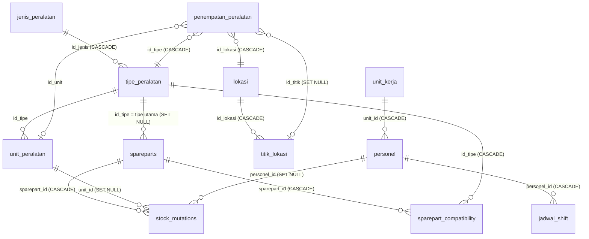

# DATABASE — Masih Berapa

Dokumentasi database Supabase (PostgreSQL) yang dipakai aplikasi **Masih Berapa**.
Isi dokumen ini diambil dari **database live** (project "SSES T2 Project", region `ap-southeast-2`, PostgreSQL 17) pada **2 Oktober 2026**, bukan hanya dari file SQL di repo. Bila ada selisih, database live yang benar; perbarui dokumen ini.

> Dokumen terkait: [ARCHITECTURE.md](ARCHITECTURE.md) · [PRD.md](PRD.md) · [../AGENTS.md](../AGENTS.md)

## Daftar isi

1. [Gambaran umum](#1-gambaran-umum)
2. [Diagram relasi](#2-diagram-relasi)
3. [Model stok](#3-model-stok-paling-penting)
4. [Kamus tabel](#4-kamus-tabel)
5. [View, fungsi, trigger, index](#5-view-fungsi-trigger-index)
6. [Keamanan: RLS dan hak akses](#6-keamanan-rls-dan-hak-akses)
7. [Riwayat migrasi](#7-riwayat-migrasi)
8. [Prosedur mengubah database](#8-prosedur-mengubah-database)
9. [Snapshot data](#9-snapshot-data)
10. [Risiko dan hal yang perlu diketahui](#10-risiko-dan-hal-yang-perlu-diketahui)
11. [File SQL di repo](#11-file-sql-di-repo)

---

## 1. Gambaran umum

- **Database ini dipakai bersama aplikasi lain.** Selain tabel milik Masih Berapa, ada tabel operasional lain (`jadwal_pm`, `laporan_operasional`, `laporan_checklist`) dan konfigurasi checklist di `master_configs`. Aplikasi ini **tidak membaca maupun menulis** tabel-tabel itu. Jangan mengubah atau menghapusnya tanpa memeriksa aplikasi lain.
- Semua primary key bertipe **`uuid`**. Aplikasi membuat UUID di sisi klien (`crypto.randomUUID()`); default `gen_random_uuid()` di database hanya untuk penulis lain.
- Semua timestamp bertipe `timestamptz` (UTC). Tampilan di UI memakai zona waktu perangkat.
- Aplikasi mengakses database langsung dari browser lewat Supabase REST (PostgREST) dengan **anon key**. Tidak ada backend. Karena itu **seluruh perlindungan data bergantung pada RLS** (lihat [bagian 6](#6-keamanan-rls-dan-hak-akses)).

### Tabel yang dipakai aplikasi ini

| Kelompok | Tabel |
|---|---|
| Master peralatan | `jenis_peralatan`, `tipe_peralatan`, `unit_peralatan`, `penempatan_peralatan` |
| Master lokasi | `lokasi`, `titik_lokasi` |
| Master personel | `unit_kerja`, `personel`, `jadwal_shift` |
| Inti sparepart | `spareparts`, `stock_mutations`, `sparepart_compatibility` |
| Rekap (view) | `current_stock` (tidak dibaca aplikasi, lihat [5.1](#51-view-current_stock)) |
| Dibaca aplikasi tetapi tidak dipakai UI | `master_configs` |

### Tabel milik aplikasi lain (tidak disentuh)

`jadwal_pm`, `laporan_checklist`, `laporan_operasional`, dan 9 baris `master_configs` berisi konfigurasi checklist/PM/Cloudinary (kunci: `briefing_spareparts`, `checklist_active_toggles`, `checklist_shift_data`, `cloudinary_config`, `master_api_t2`, `master_checklist`, `master_om_ias_t2`, `pm_display_settings`, `tip_data_Agustus_2026`). `cloudinary_config` hanya berisi `cloudName` dan `uploadPreset` (tidak ada secret).

## 2. Diagram relasi

Catatan: `sparepart_compatibility` adalah tabel penghubung banyak-ke-banyak antara sparepart dan tipe peralatan. Kolom `spareparts.id_tipe` adalah tipe **utama** (yang dipilih pertama di form katalog); semua tipe yang cocok, termasuk yang utama, ada di `sparepart_compatibility`.

## 3. Model stok (paling penting)

**Tabel `spareparts` tidak menyimpan stok.** Stok dihitung dari seluruh riwayat `stock_mutations`. Tidak ada kolom `stok_aktual` atau `stok_bekas` di database (kolom lama dihapus pada migrasi `replace_cached_stock_with_inventory_view`, 23 Juli 2026). Kolom bernama `stok_aktual` / `stok_bekas` di kode aplikasi dan di view `current_stock` adalah hasil hitung.

### 3.1 Tiga kantong stok

| Kantong | Arti | Nama di aplikasi / view |
|---|---|---|
| `baru` | barang baru siap pakai | Stok Baru / `stok_aktual` |
| `bekas` | barang bekas copotan yang masih layak pakai (rotable) | Stok Bekas / `stok_bekas` |
| `rusak` | barang rusak / afkir yang masih ada di gudang | Stok Rusak / `stok_rusak` |

`NULL` berarti **di luar gudang**. "Stok tersedia" = baru + bekas. Stok rusak tidak dihitung tersedia.

### 3.2 Setiap mutasi memindahkan qty dari satu kantong ke kantong lain

Kolom `stok_asal` (kantong yang berkurang) dan `stok_tujuan` (kantong yang bertambah) pada `stock_mutations`:

| `mutation_type` | `stok_asal` | `stok_tujuan` | Keterangan |
|---|---|---|---|
| `Masuk` | NULL | `baru` | penerimaan barang baru; kolom `sumber` diisi |
| `Pakai` | `baru` | NULL | dipakai untuk perbaikan (opsional `unit_id`) |
| `Bekas` | NULL | `bekas` | barang copotan layak pakai dikembalikan ke gudang |
| `Rusak` | `baru` atau `bekas` | `rusak` | barang tidak layak pakai; boleh langsung dari baru |
| `Serah Terima` (terima) | NULL | `baru`, `bekas`, atau `rusak` | menerima barang dari pihak lain |
| `Serah Terima` (serahkan) | `baru`, `bekas`, atau `rusak` | NULL | menyerahkan barang ke pihak lain |

Untuk `Serah Terima`, kolom `penerima` dan `unit_penerima` berisi **pihak lain** (penerima saat diserahkan, pemberi saat diterima).

**Baris tanpa `stok_asal`/`stok_tujuan`** (baris lama atau ditulis aplikasi lain) memakai default tipenya: `Masuk`→baru, `Pakai`←baru, `Bekas`→bekas, `Rusak` dari bekas ke rusak. `Serah Terima` tanpa arah **tidak mengubah stok** (aplikasi menandainya kuning di History).

Constraint `stock_mutations_aliran_stok_check` menolak kombinasi yang tidak masuk akal (contoh: `Masuk` dengan `stok_asal`, `Pakai` ke `rusak`, `Serah Terima` dua arah sekaligus).

### 3.3 Dua implementasi yang harus selalu sama

Aturan di atas ada di **dua tempat**:

1. **Database:** view `current_stock` (SQL).
2. **Aplikasi:** `src/utils/stock.ts` (TypeScript), dipakai Dashboard, validasi stok, dan perhitungan di History.

Keduanya harus menghasilkan angka yang sama. Bila aturan diubah, ubah keduanya dan buat migrasi (lihat [bagian 8](#8-prosedur-mengubah-database)).

**Vektor uji konsistensi.** Untuk satu sparepart dengan 8 mutasi berikut, kedua implementasi harus menghasilkan **baru = 4, bekas = 5, rusak = 2**:

| # | Tipe | qty | asal → tujuan |
|---|---|---|---|
| 1 | Masuk | 10 | luar → baru |
| 2 | Pakai | 3 | baru → luar |
| 3 | Bekas | 4 | luar → bekas |
| 4 | Rusak | 2 | baru → rusak |
| 5 | Rusak | 1 | bekas → rusak |
| 6 | Serah Terima (terima) | 2 | luar → bekas |
| 7 | Serah Terima (serahkan) | 1 | rusak → luar |
| 8 | Serah Terima (serahkan) | 1 | baru → luar |

Hitungan: baru = 10 − 3 − 2 − 1 = 4; bekas = 4 − 1 + 2 = 5; rusak = 2 + 1 − 1 = 2.
Uji ini sudah dijalankan pada 2 Oktober 2026 di database (sebagai role `anon`, dalam transaksi yang dibatalkan) dan di `src/utils/stock.ts`; hasilnya sama.

### 3.4 Validasi stok minus

Stok tidak boleh minus di kantong mana pun. Saat ini validasi dilakukan **di aplikasi** sebelum menulis (membaca ulang semua mutasi sparepart itu dari database, menambahkan transaksi baru, lalu memeriksa hasilnya). **Database sendiri tidak menolak stok minus**, dan pemeriksaannya tidak atomik; lihat [risiko R3](#10-risiko-dan-hal-yang-perlu-diketahui).

## 4. Kamus tabel

Tipe `varchar` tanpa angka = tanpa batas panjang. **PK** = primary key. Kolom bertanda ⚙ **dihitung/diisi aplikasi**, bukan input pengguna.

### 4.1 `jenis_peralatan`
Kategori besar peralatan.

| Kolom | Tipe | Null | Default | Catatan |
|---|---|---|---|---|
| `id` | uuid | tidak | `gen_random_uuid()` | PK |
| `nama` | varchar | tidak | | UNIQUE |
| `tampil_di_kalibrasi` | boolean | ya | `false` | dipakai aplikasi lain |

### 4.2 `tipe_peralatan`
Tipe/model di bawah satu jenis.

| Kolom | Tipe | Null | Default | Catatan |
|---|---|---|---|---|
| `id` | uuid | tidak | `gen_random_uuid()` | PK |
| `id_jenis` | uuid | ya | | FK → `jenis_peralatan` (CASCADE) |
| `nama` | varchar | tidak | | UNIQUE |
| `varian` | text | ya | | |

### 4.3 `lokasi` dan `titik_lokasi`
| Tabel.kolom | Tipe | Null | Catatan |
|---|---|---|---|
| `lokasi.id` | uuid | tidak | PK |
| `lokasi.nama` | varchar | tidak | UNIQUE |
| `titik_lokasi.id` | uuid | tidak | PK |
| `titik_lokasi.id_lokasi` | uuid | ya | FK → `lokasi` (CASCADE) |
| `titik_lokasi.nomor` | varchar | tidak | UNIQUE bersama `id_lokasi`; nilai `-` berarti "tanpa titik" |

### 4.4 `unit_peralatan`
Unit fisik (per nomor seri).

| Kolom | Tipe | Null | Default | Catatan |
|---|---|---|---|---|
| `id` | uuid | tidak | `gen_random_uuid()` | PK |
| `id_tipe` | uuid | tidak | | FK → `tipe_peralatan` |
| `serial_number`, `no_sertifikasi` | varchar | ya | | |
| `tahun_instalasi` | integer | ya | | |
| `milik` | varchar | ya | `'Injourney / AP2'` | |
| `status` | varchar | tidak | `'operasi'` | CHECK: `operasi`, `standby`, `gudang`, `rusak` |
| `catatan`, `foto_url` | text | ya | | |
| `ampere` | varchar | ya | | |
| `created_at`, `updated_at` | timestamptz | ya | `now()` | `updated_at` diisi trigger |

### 4.5 `penempatan_peralatan`
Di mana sebuah unit/tipe dipasang.

| Kolom | Tipe | Null | Default | Catatan |
|---|---|---|---|---|
| `id` | uuid | tidak | `gen_random_uuid()` | PK |
| `id_tipe` | uuid | ya | | FK → `tipe_peralatan` (CASCADE) |
| `id_lokasi` | uuid | ya | | FK → `lokasi` (CASCADE) |
| `id_titik` | uuid | ya | | FK → `titik_lokasi` (SET NULL) |
| `id_unit` | uuid | ya | | FK → `unit_peralatan` |
| `is_active` | boolean | ya | `true` | aplikasi hanya memakai baris aktif |
| `created_at` | timestamptz | ya | `now()` UTC | |

Dipakai untuk menentukan **lokasi dan unit yang cocok** saat memakai sparepart (lihat `src/utils/compatibility.ts`).

### 4.6 `unit_kerja`, `personel`, `jadwal_shift`

| Tabel.kolom | Tipe | Null | Catatan |
|---|---|---|---|
| `unit_kerja.id`, `.nama` | uuid, text | tidak | `nama` UNIQUE; `created_at` default `now()` |
| `personel.id` | uuid | tidak | PK |
| `personel.nik` | text | tidak | UNIQUE |
| `personel.nama` | text | tidak | |
| `personel.no_hp` | text | ya | **data pribadi** |
| `personel.unit_id` | uuid | ya | FK → `unit_kerja` (CASCADE) |
| `personel.jabatan` | varchar(100) | ya | |
| `personel.urutan` | integer | ya | urutan tampil |
| `jadwal_shift.id` | uuid | tidak | PK |
| `jadwal_shift.personel_id` | uuid | ya | FK → `personel` (CASCADE) |
| `jadwal_shift.tanggal` | date | tidak | UNIQUE bersama `personel_id` (satu shift per orang per hari) |
| `jadwal_shift.shift` | text | tidak | nilai di data live: `PS` (pagi/siang 08.00–20.00) dan `M` (malam 20.00–08.00) |
| `jadwal_shift.status_kehadiran` | text | ya | default `'Hadir'`; aplikasi menganggap izin/sakit/cuti/alpa/off/libur sebagai tidak berdinas |

### 4.7 `spareparts`
Master sparepart. **Tidak ada kolom stok.**

| Kolom | Tipe | Null | Default | Catatan |
|---|---|---|---|---|
| `id` | uuid | tidak | `gen_random_uuid()` | PK |
| `sku` | varchar(100) | tidak | | UNIQUE; aplikasi membuat urutan `SP-001`, `SP-002`, … |
| `name` | varchar(255) | tidak | | |
| `description` | text | ya | | |
| `id_tipe` | uuid | ya | | FK → `tipe_peralatan` (SET NULL); tipe utama |
| `unit` | varchar(50) | ya | `'PCS'` | satuan |
| `minimum_stok` | integer | tidak | `1` | CHECK ≥ 0; batas stok baru minimum |
| `lokasi` | varchar | ya | | nama gudang (teks bebas) |
| `rack` | varchar | ya | | kode rak |
| `mtbf_days` | integer | ya | `180` | umur pakai rata-rata (hari) |
| `last_replaced_at` | timestamptz | ya | | tanggal pergantian terakhir yang dicatat manual |
| `created_at`, `updated_at` | timestamptz | ya | `now()` | |

Field turunan di aplikasi (⚙, tidak ada di database): `stok_aktual`, `stok_bekas`, `stok_rusak`, `equipment_type_name`, `id_jenis` (dari tipe), dan `last_replaced_at` yang efektif (yang lebih baru antara kolom ini dan transaksi `Pakai` terakhir).

### 4.8 `stock_mutations`
Log semua pergerakan stok. **Sumber kebenaran stok.**

| Kolom | Tipe | Null | Default | Catatan |
|---|---|---|---|---|
| `id` | uuid | tidak | `gen_random_uuid()` | PK |
| `sparepart_id` | uuid | tidak | | FK → `spareparts` (**CASCADE**: menghapus sparepart menghapus riwayatnya) |
| `unit_id` | uuid | ya | | FK → `unit_peralatan` (SET NULL); unit yang diperbaiki |
| `personel_id` | uuid | ya | | FK → `personel` (SET NULL); petugas |
| `mutation_type` | varchar(50) | tidak | | CHECK: `Masuk`, `Pakai`, `Bekas`, `Rusak`, `Serah Terima` |
| `qty` | integer | tidak | | CHECK > 0 |
| `notes` | text | ya | | |
| `created_at` | timestamptz | ya | `now()` | |
| `sumber` | varchar | ya | `'VENDOR'` | asal barang (hanya bermakna untuk `Masuk`): `IAS`, `SUP API`, `SISA PEKERJAAN`, `MANDIRI`, `DARI UNIT LAIN`, `VENDOR`. **Tidak ada CHECK**; aplikasi yang membatasi |
| `location` | varchar | ya | | lokasi teks bebas; tidak ditulis aplikasi ini, tetapi ditampilkan bila ada |
| `penerima`, `unit_penerima` | text | ya | | pihak lain pada `Serah Terima` |
| `stok_asal`, `stok_tujuan` | varchar | ya | | kantong stok; CHECK `baru`/`bekas`/`rusak` atau NULL |

### 4.9 `sparepart_compatibility`

| Kolom | Tipe | Null | Default | Catatan |
|---|---|---|---|---|
| `id` | uuid | tidak | `gen_random_uuid()` | PK |
| `sparepart_id` | uuid | tidak | | FK → `spareparts` (CASCADE) |
| `id_tipe` | uuid | tidak | | FK → `tipe_peralatan` (CASCADE) |
| `is_primary` | boolean | ya | `true` | aplikasi mengisi `true` hanya untuk tipe pertama |
| `created_at` | timestamptz | ya | `now()` | |

UNIQUE (`sparepart_id`, `id_tipe`). Aplikasi menyamakan isi tabel ini dengan pilihan di form katalog (hapus yang tidak dipilih, upsert yang dipilih).

### 4.10 `master_configs`
Pasangan kunci-nilai (`key` UNIQUE, `value` jsonb, `updated_at`). Dibaca aplikasi ini ke dalam state tetapi **tidak ditampilkan atau dipakai**. Isinya konfigurasi aplikasi lain (lihat [bagian 1](#tabel-milik-aplikasi-lain-tidak-disentuh)).

## 5. View, fungsi, trigger, index

### 5.1 View `current_stock`
Rekap stok per sparepart dengan aturan [bagian 3](#3-model-stok-paling-penting): kolom `id`, `sku`, `name`, `stok_aktual`, `stok_bekas`, `stok_rusak`.

- `security_invoker = true`: view dibaca dengan hak dan RLS pembacanya.
- Hak akses: hanya `SELECT` untuk `anon` dan `authenticated`.
- **Aplikasi ini tidak membaca view ini**; ia menghitung sendiri di `src/utils/stock.ts`. View ada agar aplikasi lain atau laporan SQL memakai aturan yang sama. Definisi lengkap: [`migrations/2026-10-02_aliran_stok.sql`](migrations/2026-10-02_aliran_stok.sql).

### 5.2 Fungsi dan trigger
- Fungsi `update_updated_at_column()` mengisi `updated_at = now()`. Trigger `update_unit_peralatan_updated_at` (BEFORE UPDATE) memakainya pada `unit_peralatan`. Catatan keamanan: fungsi ini belum mengunci `search_path` (peringatan Supabase advisor).
- Tidak ada trigger pada `spareparts` atau `stock_mutations`. Aplikasi mengisi `updated_at` sendiri.

### 5.3 Index (selain primary key dan UNIQUE)
`spareparts`: `sku`, `id_tipe` (2 index), `lokasi`, `rack` · `stock_mutations`: `sparepart_id`, `created_at DESC` · `sparepart_compatibility`: `sparepart_id`, `id_tipe` · `unit_peralatan`: `status`, `id_tipe` · tabel aplikasi lain: `jadwal_pm`, `laporan_*`.

## 6. Keamanan: RLS dan hak akses

RLS **aktif** di semua tabel. Aplikasi tidak punya login, jadi semua permintaan datang sebagai role **`anon`**. Tabel di bawah menunjukkan apa yang bisa dilakukan `anon` berdasarkan policy.

| Tabel | Baca | Tulis (INSERT/UPDATE/DELETE) | Dasar |
|---|---|---|---|
| `spareparts`, `stock_mutations`, `sparepart_compatibility` | ya | **ya** | policy "Public full access" (`ALL`, `true`) untuk `anon`, `authenticated` |
| `unit_peralatan` | ya | **ya** | policy "Allow all for authenticated" sebenarnya `ALL` `true` untuk **semua** role |
| `jadwal_shift` | ya | **ya** | ada policy `*_public` (`true`) di samping policy login |
| `master_configs` | ya | **ya** | policy bernama "Allow public read access" sebenarnya `ALL` `true/true` |
| `jenis_peralatan`, `tipe_peralatan`, `lokasi`, `titik_lokasi`, `penempatan_peralatan` | ya | **tidak** (perlu login) | `ALL` dengan syarat `auth.uid() IS NOT NULL` |
| `unit_kerja`, `personel` | ya | **tidak** (perlu login) | sama |
| `jadwal_pm`, `laporan_*` (aplikasi lain) | ya | ya | policy publik |
| `current_stock` (view) | ya | tidak | hanya `SELECT` |

**Bukti uji (2 Okt 2026).** Sebagai role `anon`, dalam transaksi yang dibatalkan: INSERT ke `unit_peralatan` dan `spareparts` **berhasil**; INSERT ke `jenis_peralatan`, `lokasi`, `personel`, `unit_kerja` **ditolak** (SQLSTATE `42501`). Untuk `tipe_peralatan`, `titik_lokasi`, `penempatan_peralatan`, kesimpulan berasal dari definisi policy (sama dengan `jenis_peralatan`), belum diuji satu per satu.

**Dampak pada aplikasi:** form di halaman **Pengaturan** untuk menambah Jenis, Tipe, Lokasi, Titik, dan Personel akan gagal (pesan RLS) selama pengguna tidak login. Form Unit Peralatan, Katalog, dan transaksi stok berfungsi.

## 7. Riwayat migrasi

Tabel `supabase_migrations.schema_migrations` mencatat:

| Versi | Nama | Isi |
|---|---|---|
| 20260723115507 | `enable_rls_and_public_access_spareparts_tables` | aktifkan RLS dan policy "Public full access" pada `spareparts`, `stock_mutations`, `sparepart_compatibility` |
| 20260723121410 | `replace_cached_stock_with_inventory_view` | **hapus** kolom `stok_aktual` dan `stok_bekas` dari `spareparts`; buat view `current_stock` |
| 20260723123349 | `spareparts_view_indexes_and_constraints` | FK `ON DELETE CASCADE` dan index pada `sparepart_compatibility`, index `spareparts.id_tipe`; juga membuat view `v_spareparts` yang **sudah tidak ada** di database sekarang |
| 20261002052637 | `aliran_stok_per_transaksi` | kolom `stok_asal`/`stok_tujuan`, constraint, view `current_stock` baru |
| 20261002053010 | `current_stock_security_invoker` | view `security_invoker`, hak hanya `SELECT` |

Perubahan skema sebelum 23 Juli 2026 dibuat lewat dashboard dan tidak tercatat di tabel ini. Salinan kedua migrasi Oktober ada di [`docs/migrations/`](migrations/) beserta perintah rollback.

## 8. Prosedur mengubah database

Database ini produksi dan dipakai aplikasi lain. Ikuti urutan ini:

1. **Tulis migrasi** di `docs/migrations/AAAA-BB-HH_nama.sql`: aditif dan kompatibel ke belakang bila bisa (kolom baru boleh NULL), lengkap dengan bagian ROLLBACK di komentar.
2. **Uji tanpa meninggalkan jejak**: bungkus migrasi + data uji dalam satu blok `DO $$ ... $$` yang diakhiri `RAISE EXCEPTION` agar semuanya dibatalkan. Jalankan juga sebagai `SET LOCAL ROLE anon` bila menyangkut RLS atau view. Setelah itu pastikan jumlah baris dan skema tidak berubah.
3. **Periksa kesesuaian dengan aplikasi**: bila menyangkut aturan stok, ubah `src/utils/stock.ts` dan cocokkan dengan vektor uji di [3.3](#33-dua-implementasi-yang-harus-selalu-sama).
4. **Terapkan** lewat Supabase (`apply_migration` atau SQL Editor), setelah mendapat persetujuan pemilik database.
5. **Verifikasi** (kolom/constraint ada, `get_advisors` keamanan tidak bertambah temuan) lalu **perbarui dokumen ini** dan `docs/schema_relational_supabase.sql`.
6. Terapkan migrasi **sebelum** men-deploy kode yang membutuhkannya.

## 9. Snapshot data

Jumlah baris pada 2 Oktober 2026 (berubah seiring waktu; hanya untuk gambaran skala):

| Tabel | Baris | Tabel | Baris |
|---|---|---|---|
| `jenis_peralatan` | 9 | `spareparts` | 4 |
| `tipe_peralatan` | 16 | `stock_mutations` | 0 |
| `lokasi` | 42 | `sparepart_compatibility` | 0 |
| `titik_lokasi` | 164 | `unit_kerja` | 2 |
| `unit_peralatan` | 135 | `personel` | 22 |
| `penempatan_peralatan` | 202 | `jadwal_shift` | 616 |
| `master_configs` | 9 | (aplikasi lain) `jadwal_pm` 761, `laporan_operasional` 192, `laporan_checklist` 9 | |

Sparepart sudah terdaftar tetapi belum ada satu pun transaksi stok, jadi semua stok saat ini 0.

**Skala.** Aplikasi memuat **seluruh** `stock_mutations` ke browser (dibaca per halaman 1.000 baris) setiap kali data dimuat ulang. Kinerjanya **belum diuji dengan data besar** (saat ini 0 baris). Bila riwayat tumbuh hingga puluhan ribu baris, ukur waktu muat dan pertimbangkan agregasi/pagination di sisi database.

## 10. Risiko dan hal yang perlu diketahui

| # | Risiko | Dampak | Saran |
|---|---|---|---|
| R1 | Tanpa login, siapa pun yang punya URL aplikasi dan anon key bisa mengubah/menghapus `spareparts`, `stock_mutations`, `unit_peralatan`, `jadwal_shift`, `master_configs` | data stok bisa dirusak | tambah Supabase Auth + perketat policy menjadi `authenticated` |
| R2 | `master_configs` dapat **ditulis** oleh `anon` (policy bernama "read" tetapi `ALL`) | konfigurasi aplikasi lain bisa diubah | ubah policy menjadi `SELECT` untuk publik; tulis hanya untuk `authenticated` |
| R3 | Validasi stok minus hanya di aplikasi dan tidak atomik: dua pengguna yang mencatat bersamaan bisa sama-sama lolos | stok bisa minus (tampil 0 karena dipotong di UI) | trigger/constraint di database yang menolak stok minus |
| R4 | `personel` (termasuk `nik` dan `no_hp`) bisa dibaca publik | data pribadi terpapar | batasi `SELECT` ke `authenticated` atau sembunyikan kolom |
| R5 | Form master di Pengaturan gagal tanpa login ([bagian 6](#6-keamanan-rls-dan-hak-akses)) | fitur terlihat tersedia tetapi gagal | login, atau jadikan tab tersebut hanya-baca |
| R6 | Menghapus sparepart menghapus seluruh riwayat mutasinya (CASCADE) | riwayat audit hilang | UI sudah meminta konfirmasi; pertimbangkan soft-delete |
| R7 | `sumber` tidak punya CHECK; aplikasi lain bisa menulis nilai bebas | filter/laporan tidak konsisten | tambahkan CHECK atau tabel referensi |
| R8 | View `current_stock` dan `src/utils/stock.ts` bisa menyimpang bila hanya salah satu diubah | angka berbeda antar aplikasi | selalu ubah keduanya; jalankan vektor uji |
| R9 | `function_search_path_mutable` pada `update_updated_at_column`; perlindungan password bocor Auth belum aktif | peringatan keamanan (WARN) | `SET search_path = ''` pada fungsi; aktifkan di dashboard Auth |

## 11. File SQL di repo

| File | Status |
|---|---|
| `docs/schema_relational_supabase.sql` | **Acuan skema** (disinkronkan dengan database live). Aman dibaca; jangan dijalankan ulang di produksi. |
| `docs/migrations/2026-10-02_aliran_stok.sql` | Sudah diterapkan. |
| `docs/migrations/2026-10-02_current_stock_security_invoker.sql` | Sudah diterapkan. |
| `docs/schema_relational_supabase_v2.sql` | **Usang. Jangan dijalankan.** Skrip migrasi lama TEXT→UUID; database sudah memakai UUID. |
